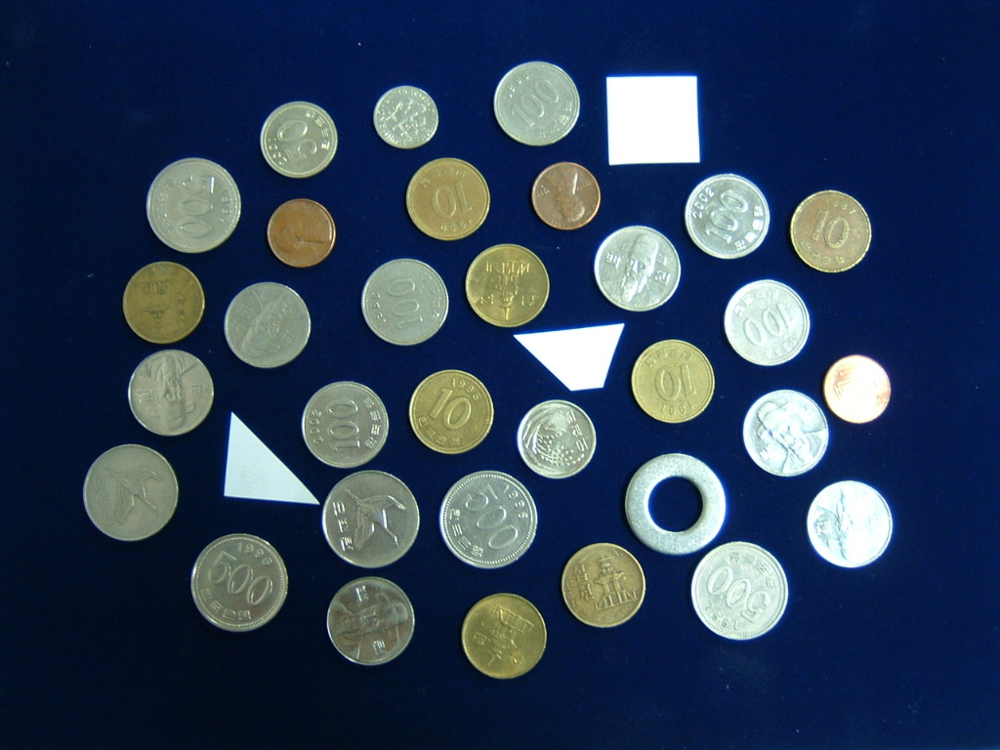
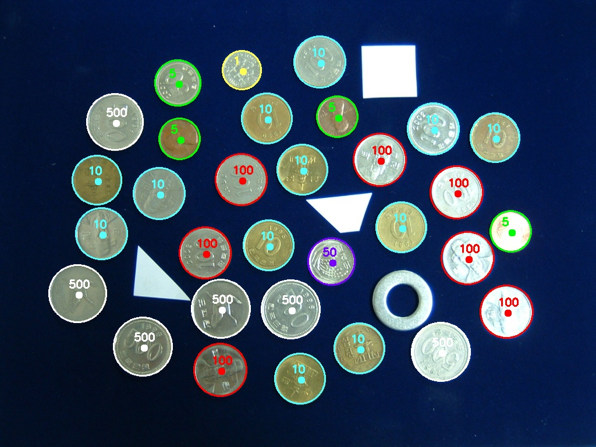

<h1 align="center">
  Coin Detector
</h1>

This is a simple Python program that detects coins from the input image. Final lab assignment of Pattern Recognition class at NUM.

<h2 align="center">Input image</h2>

<h2 align="center">Detected coins</h2>

<h2 align="center">
License
 
<a href="https://choosealicense.com/licenses/mit/">MIT</a>
</h2>
